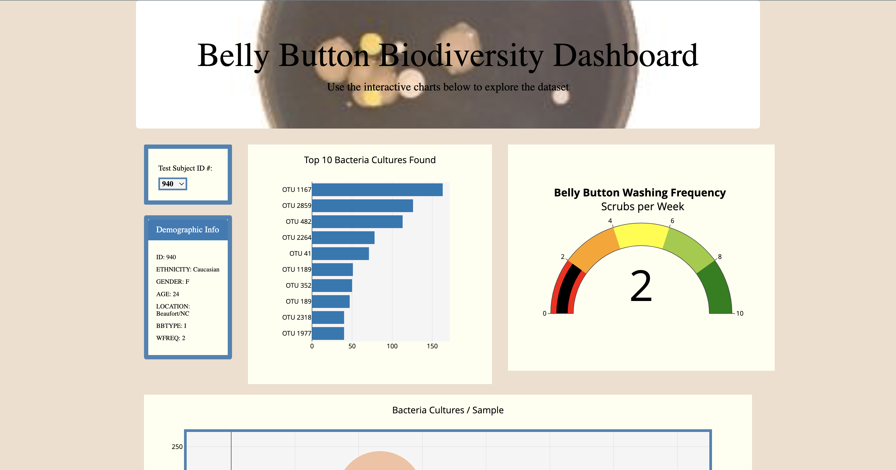

# Plotly & Belly Button Biodiversity

---

Our client, a biological researcher, Roza, is tasked with discovering and documenting several understudied and unknown bacterial species. She is focusing on bacteria that synthesizes proteins tasting similar to beef; specifically bacteria in a human's belly button. We are to aid her in creating a dashboard that dispalys the data that she has consolidated, for the researchers as well as the participants.

 

Here's a visual of the dashboard that we've built:

    

